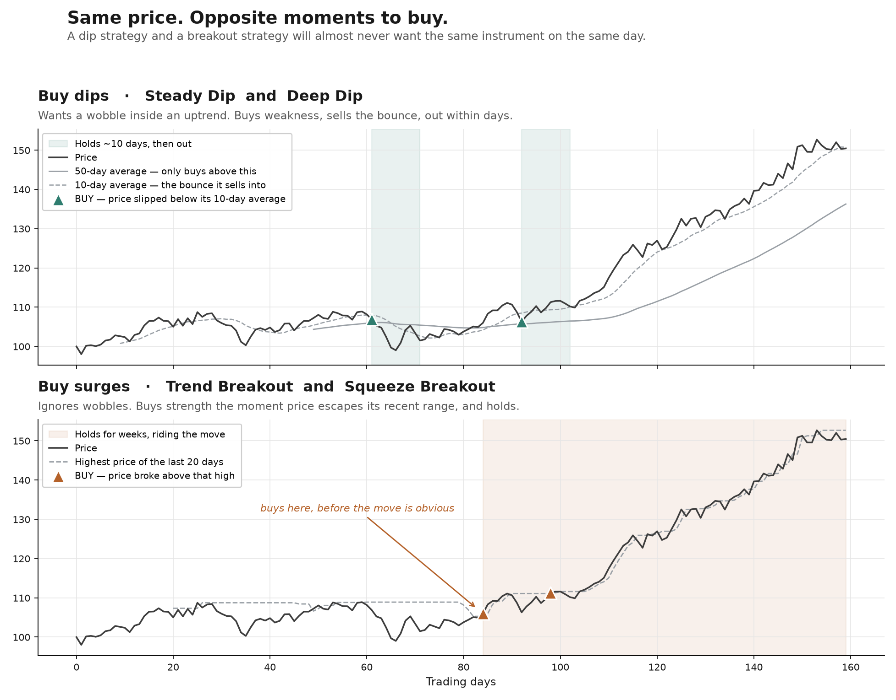

# 23. Strategy structure: three segments, shared implementations, one strategy per configuration

## Status

Accepted. Supersedes the roster section of ADR 0009.

## Context

ADR 0009 chose five strategies so that strategies could be compared against each other, which
needs more than one. That reasoning still holds. What it did not anticipate is that the five
would turn out to be three ideas, two of them implemented twice.

The overlap became undeniable after the Low-Vol Compounder deep dive (ADR 0021) turned that
strategy into a dip-buyer, putting it in the Volatility Harvester's territory. Laid out by what
actually makes each one buy:

| What makes it buy | Strategies |
| --- | --- |
| A dip | Low-Vol Compounder, Volatility Harvester |
| A surge | Trend Follower, Volatility Breakout |
| Cheap fundamentals | Value/Quality Dip-Buyer |

Two pairs and a singleton. The pairs are not complementary — they are the same bet written twice,
which means every cross-cutting decision (the cost model, volatility-scaled exits, confidence
calibration, universes) has to be made and tested twice for no additional information.

Three further facts pushed on the shape:

- The deep dive is where a strategy's worth is established, and the first one concluded the
  strategy had no edge at all. Five deep dives at that hit rate is a lot of work for a roster
  that may not survive it.
- Trend Follower's moving-average crossover fired **13 times in six years**, against 731 for its
  N-day-high entry. A signal that rare cannot be evaluated within any useful horizon.
- The names had drifted from the behaviour. "Value/Quality **Dip-Buyer**" is the value strategy
  while the Compounder and Harvester are the actual dip-buyers; "Low-Vol Compounder" no longer
  compounds, and low volatility became a risk cap rather than its identity (ADR 0021).

A naive merge — one strategy with several modes — was the obvious response and is wrong. A `Book`
belongs to one `Strategy`, so merging two strategies into one merges their P&L, and the ability
to tell which half worked is the thing the whole attribution layer exists to provide.

## Decision

### Three segments, one reserved

| Segment | Implementation | Strategies (a `Book` each) | Style | Typical hold |
| --- | --- | --- | --- | --- |
| Buy dips | `pullback` | Steady Dip, Deep Dip | `trading` | days / weeks |
| Buy surges | `breakout` | Trend Breakout, Squeeze Breakout | `trading` | weeks |
| Buy cheap | `value` | Quality Value | `investment` | months |
| Buy events | — | *reserved, not built* | — | days |

*The two `trading` segments on one simulated price series: the dip entries fall on local weakness, the breakout entries on local strength, and the hold periods differ by an order of magnitude. Illustrative — generated data, not a backtest.*

A segment is a grouping for humans, not a domain concept — nothing in the system needs to know
one exists. What the system sees is what it saw before: `Strategy` rows, each with a `Book`.

### One implementation, several registered strategies

Each segment is one piece of code. The strategies within it are configurations of that code,
registered separately, each with its own `Strategy` row, `Book`, `Strategy config version`
history and track record.

This is what the naive merge gets wrong and this gets right. Steady Dip is the `pullback`
implementation set shallow, on GBP trackers, without adds; Deep Dip is the same implementation
set deep, on a wider universe, with adds enabled. One codebase to maintain and reason about, two
independently measurable strategies.

The real prize is that the difference between them becomes a *configuration* difference. "Is
shallow-on-trackers better than deep-on-anything?" stops being an argument about strategy design
and becomes a comparison the promote/demote machinery already knows how to make. It also gives
each remaining deep dive a falsifiable question: if no setting of the shared implementation makes
the pair behave differently, they are one strategy and one of them should go.

`seed.py` already separates key, name, style and params, so most of this is already
configuration. The one thing hard-wiring a strategy to a class is `register_strategy`, which
keys the registry off `cls.key`; it needs to take an explicit key instead.

The cost, stated plainly: shared code means a change made for one configuration can break the
other. That is the price of not maintaining the same logic twice, and it is the cheaper of the
two.

### The moving-average crossover entry is dropped

13 signals in six years is unmeasurable. It is not being dropped for being wrong — it is being
dropped because a system built to measure strategies cannot measure this one, and carrying an
unfalsifiable entry is worse than not having it. It returns as a setting, not a rewrite, if there
is ever a reason.

### Strategies are renamed

The old names now actively mislead, and the collision on "dip" would be permanent. Renaming costs
a migration and breaks continuity with the existing demo history — which is worth nothing, having
been produced by four instruments and strategies since established not to work. It will never be
cheaper than now.

### Events is a named, empty segment

Trading around a scheduled event — an earnings date, a product announcement — is the one genuinely
different fourth thing: it triggers on a *date* rather than a price pattern. Naming it without
building it stops it being quietly re-invented as a setting on a price-based strategy, and makes
the earnings-date data work legible as groundwork rather than a detour.

It carries a warning: it is the hardest idea in the set and the most likely to lose money
confidently. The expected move around a known event is already in the price, and the better
documented effect is the drift *after* an announcement rather than the run-up before it — which
is the opposite of the intuitive trade. It needs real evidence before real money, more than
anything else in the roster.

### The capital budget is applied before approval, not after

ADR 0020 bounds what a pass may commit. This fixes where that bound sits relative to approval:
signals that do not fit the budget are never queued for approval.

At 30 instruments the roster proposes roughly 17 entries a day. With approval set to manual,
applying the budget after approval would mean hand-reviewing 17 signals so that four can run —
and an approval queue that wastes the reviewer's attention is an approval queue that stops being
read, which disables the safety mechanism it exists to be.

Unfunded signals are still recorded and still get a `Counterfactual outcome`; the user is simply
not asked about them.

## Consequences

- The roster stays at five strategies but drops to three implementations. Signal volume is
  essentially unchanged — the structure does not reduce it, the capital budget bounds it.
- Renaming means a migration over `Strategy.key`, and existing `Book`s, `Signal`s and history
  move with it. Acceptable precisely because that history is not worth preserving.
- The pair merges are agreed in structure but performed at each pair's deep dive, where there is
  evidence about whether the shared implementation genuinely covers both. Agreeing the shape now
  prevents two more strategies being designed as though they were independent.
- `CONTEXT.md`'s `Strategy` entry said "v1 ships five concrete strategies", which is no longer the
  useful description; it now describes the relationship between implementations and strategies.
- The `style` tag survives unchanged and still earns its place: dips and surges are `trading`,
  value is `investment`, and it still gates the research tier.
